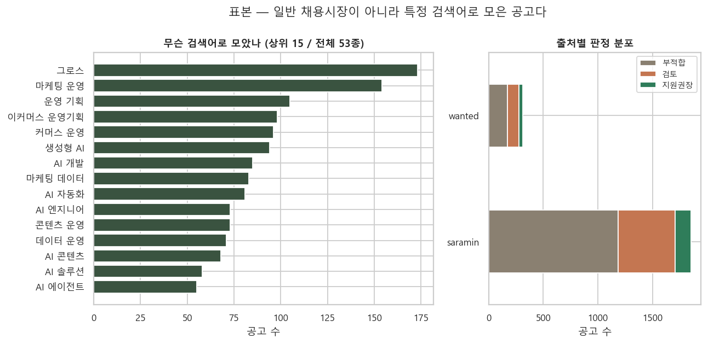
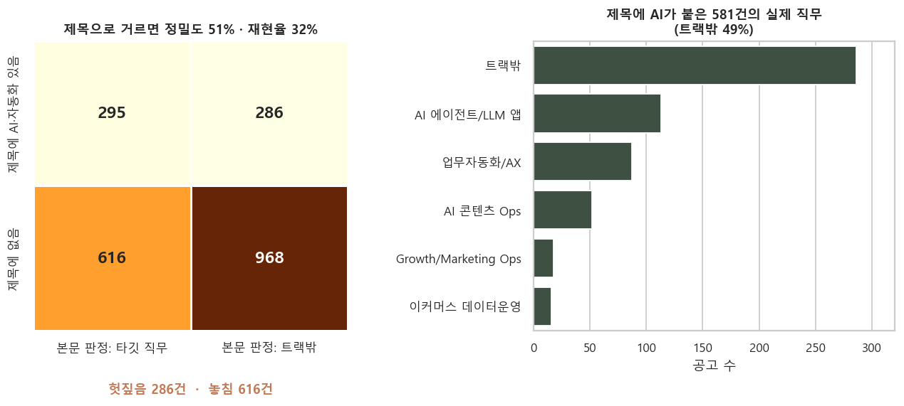
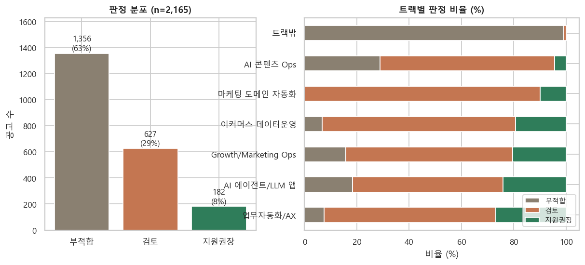
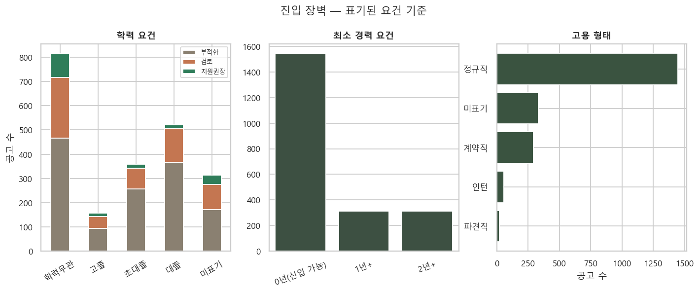
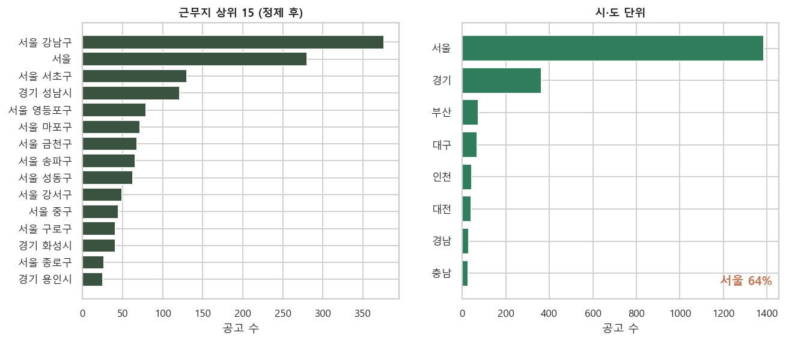
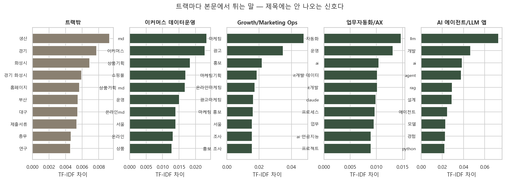
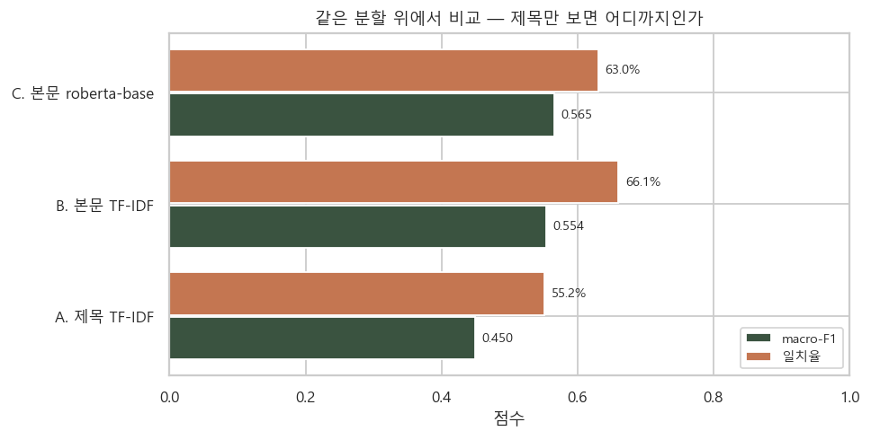
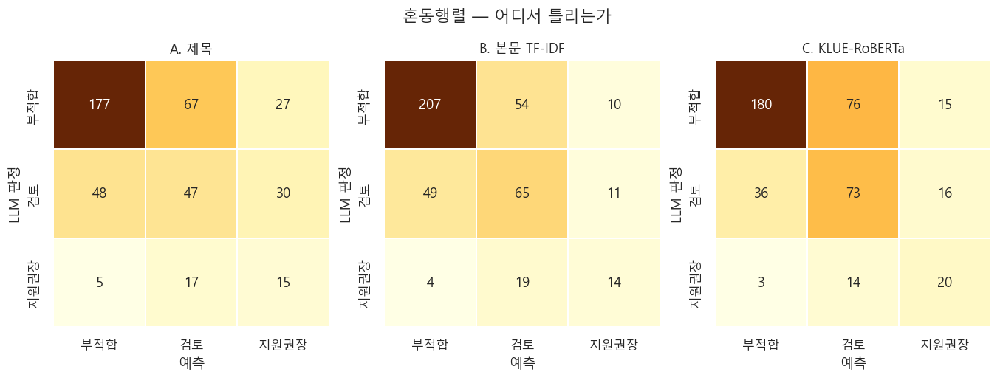
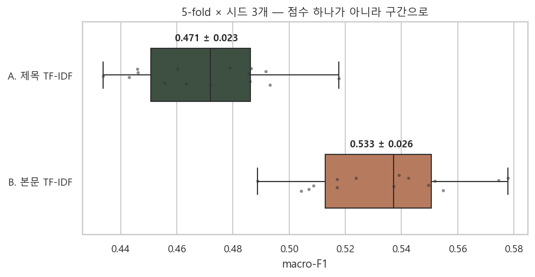

# 제목의 AI와 본문의 AI는 다르다

채용공고 **2,165건**을 놓고 확인한 것 하나 — **제목에 "AI"가 붙은 공고의 절반은 실제로 AI 직무가 아니고, 진짜 AI 직무의 68%는 제목에 그 단어가 없다.**

그래서 공고를 제목으로 거르면 안 되고, 본문을 읽어야 한다. 이 저장소는 그 주장을 EDA와 분류 모델 세 개로 실증한 기록이다.

```
데이터 2,165건  →  EDA (표본·괴리·장벽)  →  모델 3단 비교  →  파이프라인 투입 판단
```

---

## 1. 데이터

| | |
|---|---|
| 표본 | 채용공고 **2,165건** (사람인 1,852 · 원티드 313) |
| 수집 | 2026-07-15 ~ 2026-07-20 · 검색어 53종 |
| 본문 | 평균 **2,508자** · 빈 본문 **0건** |
| 라벨 | `verdict` 3클래스 — 부적합 1,356 / 검토 627 / 지원권장 182 |
| 조인 | 판정 ↔ 수집 원본 **2,165 / 2,165 (100%)** |

수집은 [job-radar](https://github.com/enometa820/job-radar-pipeline) 파이프라인이 했고, 공개 채용공고만 사용한다.

### 이 표본에 대해 먼저 밝혀야 하는 두 가지

**① 일반 채용시장이 아니다.** AI·자동화·데이터 운영 검색어 53종으로 모은 표본이다. "한국 채용시장은 이렇다"고 말할 수 없고, 이 글도 그렇게 말하지 않는다.

**② 라벨은 사람 정답이 아니라 LLM 판정이다.** 취업 컨설턴트 페르소나를 준 LLM이 본문을 읽고 매긴 값이라, 아래 지표는 전부 **"정확도"가 아니라 "LLM 판정과의 일치율"**로 읽어야 한다. 이 작업의 정확한 이름은 정답 학습이 아니라 **판정 증류(distillation)**다.



---

## 2. EDA — 제목으로 거르면 무엇을 잃는가

"제목에 AI·자동화가 있으면 타깃 직무"라는 규칙을 분류기로 보고 채점했다.

| | 값 |
|---|---|
| 정밀도 | **51%** — 제목에 AI가 붙은 581건 중 286건이 실제로는 트랙밖 |
| 재현율 | **32%** — 실제 타깃 직무 911건 중 616건은 제목에 그 단어가 없다 |



**진짜 손실은 헛짚음(286건)이 아니라 놓침(616건)이다.** 제목 필터는 눈에 띄는 오탐을 만들면서, 조용히 3분의 2를 버린다.

### 그 밖에 본 것






- **학력** — 학력무관 814 · 대졸 522 · 초대졸 358 · 고졸 158. 학력무관 구간에서 지원권장 비율이 뚜렷하게 높다
- **경력** — 최소 경력 0년 표기가 71%
- **지역** — 서울 64%
- **본문 특징어** — 트랙을 가르는 말은 제목이 아니라 본문에만 나온다. 위 차트가 그 근거다

### 데이터 정제

| 문제 | 조치 |
|---|---|
| 근무지에 뒤 칸이 섞여 들어옴 (`서울 강남구 신입·` 등) | 시/도 + 시군구까지만 남기는 정규화 → **329종 → 147종** |
| `annual_to`에 100년 같은 값 59건 | 상한 미표기 센티널로 보고 분석에서 제외 |

목록 HTML을 문자열로 자르는 수집기의 한계가 그대로 남아 있던 것이라, 정제 전후를 함께 적었다.

---

## 3. 모델 — 세 개를 같은 분할 위에서

타깃은 `verdict` 3클래스. 클래스가 63 : 29 : 8로 기울어 있어 **macro-F1**을 주 지표로 쓰고, 학습에는 클래스 가중치를 준다. 분할은 stratified 8:2, seed 고정(42).

| | 모델 | 일치율 | macro-F1 | 학습 시간 |
|---|---|---|---|---|
| A | 제목 TF-IDF + LogReg | 55.2% | 0.450 | 0.1s |
| B | **본문 TF-IDF + LogReg** | **66.1%** | 0.554 | 2.5s |
| C | 본문 KLUE-RoBERTa 파인튜닝 | 63.0% | **0.565** | 133.2s |




### 교차검증 — 점수 하나는 그 분할에서만 참이다

5-fold × 시드 3개로 15번 다시 쟀다.

| 모델 | 단일 분할 | **5-fold × 3 시드** |
|---|---|---|
| A. 제목 TF-IDF | 0.450 | **0.471 ± 0.023** |
| B. 본문 TF-IDF | 0.554 | **0.533 ± 0.026** |
| 격차 | +0.104 | **+0.062** |



**단일 분할이 격차를 부풀리고 있었다.** +0.104는 그 분할에서만 참이고, 15회 평균은 +0.062다. 그래도 표준편차(0.025)의 **2.5배**라 방향은 유지된다. 처음 수치를 지우지 않고 둘 다 남긴다 — 왜 교차검증이 필요한지가 이 표에 있다.

### 읽는 법

**A → B 격차가 이 저장소의 주장이다.** 같은 알고리즘에 입력만 제목에서 본문으로 바꿨는데 macro-F1이 올랐다. 제목에 없는 신호가 본문에 있다는 뜻이다.

### "본문에 AI가 있으면 타깃인가" — 따로 재봤다

| 필터 | 정밀도 | 재현율 | 놓침 |
|---|---|---|---|
| 제목에 AI·자동화 | 50.6% | 32.5% | 615건 |
| **본문에 AI·자동화** | 42.3% | **95.9%** | **37건** |

본문을 보면 놓침이 615 → 37건으로 준다. **다만 본문에 그 단어가 있는 공고가 2,065건, 전체의 95%다.** 요즘 공고는 거의 다 어딘가에서 AI를 말하므로, 단어 유무를 필터로 쓰면 아무것도 걸러지지 않는다.

> **신호는 "AI라는 단어가 있느냐"가 아니라 "어떤 맥락에서 쓰였느냐"다.** 그게 LLM 판정이 하는 일이고, 위 모델이 배우는 것이다.

**딥러닝은 기대만큼 이기지 못했다.** macro-F1은 0.565로 근소하게 앞섰지만 일치율은 오히려 낮고(63.0% vs 66.1%) 학습에 **50배** 더 걸린다. 2,165건은 사전학습 모델을 제대로 활용하기에 넉넉한 양이 아니다. 이 결과를 유리하게 고치지 않고 그대로 싣는다.

**다만 소수 클래스에서는 다르다.** 지원권장 재현율이 TF-IDF 0.378 → RoBERTa **0.541**이다. 놓치면 비싼 클래스를 더 잘 잡는다는 뜻이라, 용도에 따라 선택이 갈린다.

---

## 4. 그래서 파이프라인에 넣을 만한가

수집한 공고를 LLM이 전수 판정하는 구조라, 매 사이클 에이전트 20개가 15~20분을 쓴다. **명백한 부적합을 앞단에서 걸러내면 그 비용이 준다.** 문제는 걸러내다 지원권장을 잃는 것이다.

부적합으로 예측된 것을 LLM 호출 전에 제거한다고 가정하면,

| 모델 | 앞단에서 제거 | 그중 실제 지원권장 |
|---|---|---|
| B. 본문 TF-IDF | 평가셋의 **60%** | 4건 (**1.5%**) |
| C. KLUE-RoBERTa | 51% | 3건 (1.4%) |

**LLM 호출을 60% 줄이면서 지원권장 후보의 1.5%를 잃는다.** 손실률이 비슷한데 TF-IDF가 더 많이 걸러내고 50배 빠르므로, **1차 필터로는 TF-IDF가 낫다**는 것이 이 실험의 결론이다.

### 실제로 붙였다 — 그리고 이식 검증이 버그를 잡았다

[job-radar](https://github.com/enometa820/job-radar-pipeline)는 **"외부 의존성 0 · Node 내장만"**이 원칙이라 파이썬 런타임을 붙일 수 없다. 선형 모델이라 **어휘·idf·계수를 JSON(0.5MB)으로 내보내 순수 JS로 추론**하게 만들었다. 피처는 8,000개 — 5만 개보다 오히려 성능이 좋았다(0.583 vs 0.571).

**문제는 전처리 이식이 맞는지 아무도 보증하지 않는다는 것이다.** 소문자화·sublinear_tf·l2 정규화 중 하나만 빠뜨려도 **예외는 안 나고 조용히 다른 판정이 나온다.** 그래서 파이썬 예측 60건을 픽스처로 박아 두고 대조하는 테스트를 먼저 만들었다.

그 테스트가 실제로 둘을 잡았다.

| 버그 | 증상 | 원인 |
|---|---|---|
| ① | 라벨 **59/60** — 1건 오판 | 파이썬 `\b`(워드 경계)를 JS가 재현 못 함. `3D프린터`에서 파이썬은 토큰을 안 만드는데 JS는 `d프린터`를 만들었다 |
| ② | 확률 오차 **5.6e-2** — 2건 | 경계 문자 집합을 한글·영문으로만 잡음. 파이썬 `\w`는 한자·일본어까지 포함한다. `\p{L}\p{N}\p{M}`로 넓혀 맞췄다 |

최종 **라벨 60/60 일치 · 확률 오차 7.46e-7**(반올림 수준). 확신 0.6 미만은 그냥 LLM에 넘기고, **걸러낸 목록은 항상 파일로 남긴다** — 필터가 조용히 삼키면 나중에 확인할 방법이 없다.

---

## 5. 한계

- **라벨이 LLM 판정이다.** 사람 정답 대비 성능이 아니라 LLM과의 일치율이다. LLM이 틀린 자리는 모델도 같이 틀린다
- **표본이 6일치**(2026-07-15 ~ 07-20)다. 계절성·시장 변화는 볼 수 없다
- **검색어 53종이 표본을 정의한다.** 일반 채용시장의 분포가 아니다
- **딥러닝을 충분히 튜닝하지 않았다.** epoch 3 · max_len 256 · 단일 시드다. 더 돌리면 나아질 여지가 있고, 그걸 안 했다는 사실을 성능 결론과 함께 적어 둔다
- **라벨 신뢰도를 아직 안 쟀다.** 100건을 사람이 직접 판정해 LLM과 대조하는 도구(`src/make_label_sheet.py` → `src/label_agreement.py`)는 만들어 뒀지만 아직 채우지 않았다. **이걸 재기 전까지 위 지표는 "LLM과 얼마나 같은가"일 뿐 "얼마나 맞는가"가 아니다**
- **공개 데이터셋은 익명화본이다.** 원본에 채용 담당자 전화번호가 486건(22.4%) 있었고 실명 회사 1,670곳이 들어 있었다. `src/anonymize.py`가 전화·이메일·URL·주소를 마스킹하고 회사명을 해시한 뒤, **잔여 패턴 0을 확인해야만** 통과시킨다. 본문 텍스트 자체는 남겨 재현이 되게 했다

---

## 6. 재현

```bash
pip install pandas numpy scikit-learn seaborn matplotlib pyarrow
pip install torch --index-url https://download.pytorch.org/whl/cu126   # GPU 학습 시
pip install transformers

python src/build_dataset.py --radar <job-radar 경로>   # 조인 → data/dataset.parquet
python src/eda.py                                      # 차트 6장 + 요약
python src/models.py                                   # 모델 3단 비교
python src/models.py --skip-transformer                # TF-IDF만 (CPU, 3초)
```

| 파일 | 역할 |
|---|---|
| `src/build_dataset.py` | 판정 ↔ 수집 원본 조인 · 지역 정규화 · parquet 저장 |
| `src/eda.py` | 차트 6장 · `reports/eda_summary.md` |
| `src/models.py` | 모델 A·B·C · 혼동행렬 · `reports/model_results.json` |
| `reports/` | 차트와 지표 (공개) |
| `data/` | 본문 포함 데이터셋 (**비공개** — `.gitignore`) |

환경: Python 3.11 · pandas 2.3 · scikit-learn 1.8 · seaborn 0.13 · torch 2.13+cu126 · transformers 4.46 · RTX 3060 Laptop 6GB
